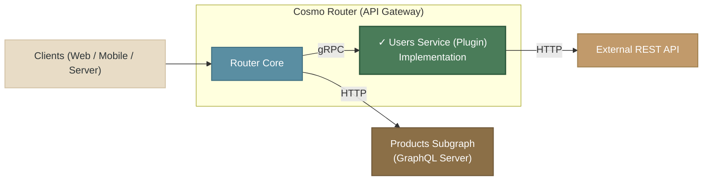

<p align="center">
  <a href="https://github.com/wundergraph/cosmo-plugin-demo">
    
  </a>
</p>

<p align="center">Seamlessly design your API schema with GraphQL Federation and implement your services with gRPC</p>

<p align="center">
  <a href="#features">Features</a> •
  <a href="#demo">Demo</a> •
  <a href="#getting-started">Getting Started</a> •
  <a href="#license">License</a>
</p>

---

[](https://github.com/wundergraph/cosmo-plugin-demo/actions/workflows/lint-test.yaml)

## ✨ Features

- **Schema-First GraphQL**: Define your data contract in SDL and generate type-safe gRPC resolvers instantly
- **gRPC Backends**: Leverage gRPC's binary protocol for blazing-fast RPC with built-in codegen for go (More languages coming soon)
- **API Bridging**: Wrap legacy REST or SOAP services behind GraphQL types without rewriting existing backends
- **End-to-End Type Safety**: Maintain type integrity from schema to transport with auto-generated clients and servers

## 🚀 Demo



This demo showcases a federated GraphQL architecture with two different implementation approaches:

- **[Users Subgraph](cosmo-router/plugins/users)**: Implemented as a Go-based Router plugin (Cosmo Connect) running directly inside the Cosmo Router - no separate service needed
- **[Products Subgraph](subgraphs/products)**: Traditional standalone GraphQL server using Apollo Server (running on port 3011)
- **[Cosmo Router](cosmo-router)**: Composes both subgraphs into a unified GraphQL API (running on port 3010)

The architecture demonstrates how Router plugins enable:

- Direct integration with external services (REST APIs, databases, gRPC services) through the plugin layer
- Embedded subgraphs with optimal performance by running inside the router process
- Seamless bridging between GraphQL and any backend protocol
- Traditional standalone subgraphs (Products) for compatibility with existing systems

## 🛠️ Getting Started

### Prerequisites

- Linux or macOS
- Node.js [LTS](https://nodejs.org/en/about/releases/)
- npm or yarn

### Installation

1. Clone the repository:

   ```bash
   git clone https://github.com/wundergraph/cosmo-plugin-demo.git
   cd cosmo-plugin-demo
   ```

2. Install dependencies:

   ```bash
   npm install
   ```

3. Build the plugin, start the router and the subgraphs:

   ```bash
   npm start
   ```

4. Open the GraphQL Playground at [http://localhost:3010](http://localhost:3010)
   and run the following query:
   ```graphql
   query {
     users {
       id
       name
       email
       role
       products {
         id
         name
         price
         description
       }
     }
   }
   ```

## 📝 License

This project is licensed under the Apache License 2.0. See the [LICENSE](LICENSE) file for details.

---

<p align="center">Made with ❤️ by <a href="https://github.com/wundergraph">WunderGraph</a></p>
